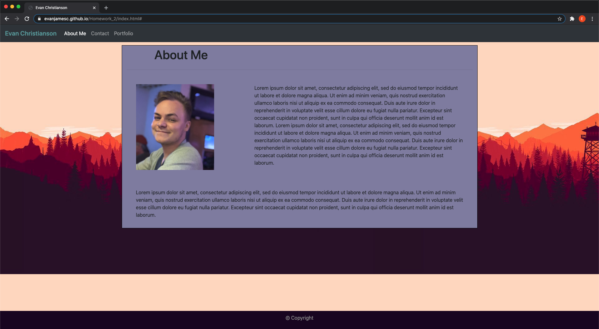
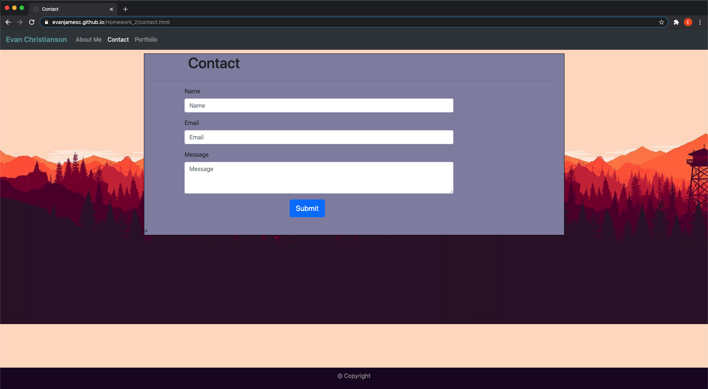
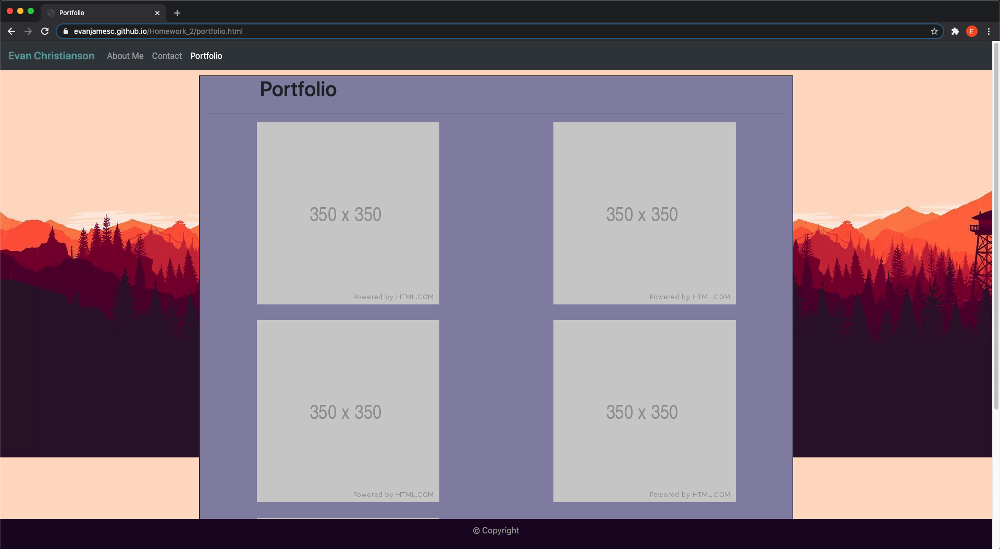
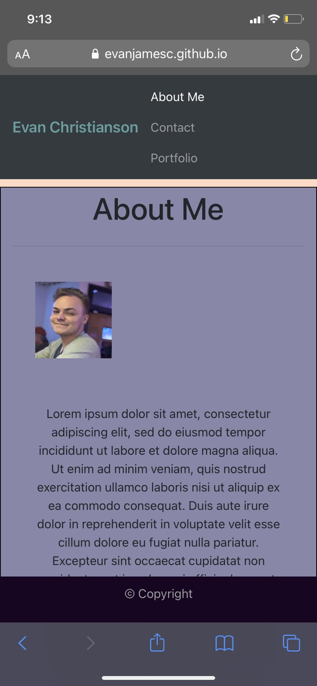
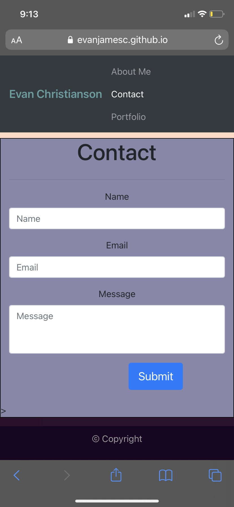
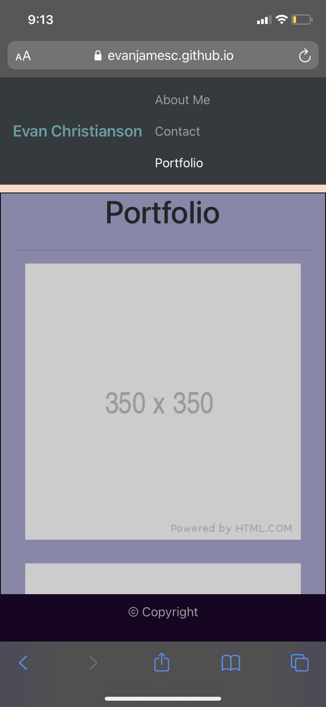

# Homework_2
## Description:
Created a portfolio site with an about me section and a contact form.
 
Portfolio currently consists of placeholder images.

## Desktop Screenshots:
  
  
  

## Mobile Screenshots:
  
  
  

## Links:
https://github.com/evanjamesc/Homework_2
 
https://evanjamesc.github.io/Homework_2/

## Notes:
Still getting the hang of the bootsrap grid and making pages responsive to screen size  
(particularly the profile image on the about me page)